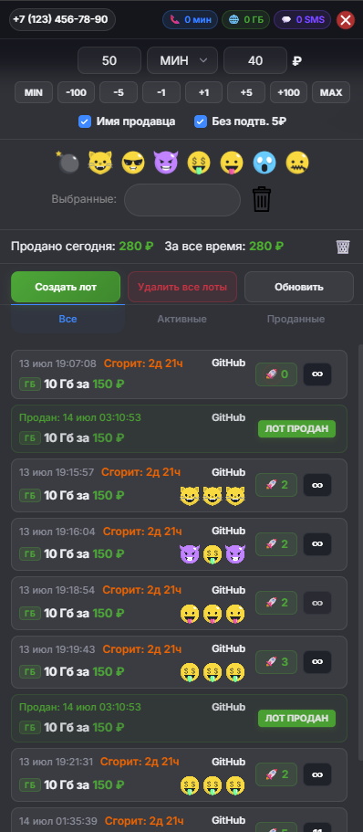

# t2-market-assistant

[](LICENSE)
[](https://github.com/bunn1-x/t2-market-assistant/releases)

Браузерное расширение для оптимизации и автоматизации торговли на бирже Маркета t2 (бывш. Tele2).

<p align="center">
  
</p>

## Возможности

* **Rocket Bump:** Быстрое поднятие лотов в топ за 5 ₽ с автоподтверждением.
* **Trade Log:** Локальный подсчет чистой прибыли с учетом расходов на продвижение лотов.
* **Quick Volume:** Кнопки быстрой корректировки объема лота (+1, +5, +10, MAX).
* **UI/UX:** Минималистичная темная тема в стиле glassmorphism с поддержкой системных настроек.
* **Manifest V3:** Поддержка всех современных Chromium-браузеров.

## Установка

### Вариант 1: Из архива (Рекомендуется)
1. Скачайте архив последней версии со страницы [Releases](https://github.com/bunn1-x/t2-market-assistant/releases) (кнопка `Source code (zip)`).
2. Распакуйте скачанный ZIP-архив в любую удобную папку на вашем компьютере.

### Вариант 2: Через Git
```bash
git clone https://github.com/bunn1-x/t2-market-assistant.git
```

### Подключение в браузер
1. Откройте страницу управления расширениями `chrome://extensions/` в браузере.
2. Включите **«Режим разработчика»** (Developer mode) в правом верхнем углу.
3. Нажмите кнопку **«Загрузить распакованное расширение»** (Load unpacked) в левом верхнем углу.
4. Выберите папку, в которую вы распаковали архив (или клонировали репозиторий).

## Отказ от ответственности

Расширение использует публичный API биржи Маркета t2 исключительно от имени авторизованного пользователя.
Автор не несёт ответственности за возможные последствия использования, включая ограничение или блокировку аккаунта со стороны оператора.
Используйте на свой страх и риск.

## Лицензия

[MIT](LICENSE)
